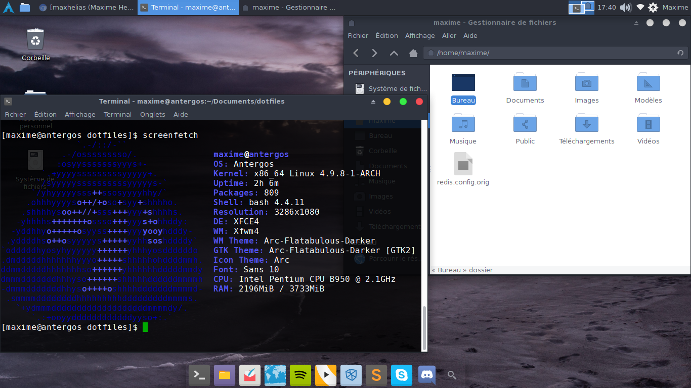

# A propos

Ce dépôt est une sauvegarde en cas de formatage ou de perte de mes informations préférées concernant mon installation Linux.


[](https://raw.githubusercontent.com/maxhelias/dotfiles/master/screenshots/screenshot.png)

La liste des paquets installés sur ma machine est disponible dans le fichier package.list.

```
cat package.list | xargs yaourt -S --needed --noconfirm
```

# Trucs & Astuces

## Remapper touches du clavier

Pour activer la touche "Scroll Lock" qui me permet d'activer les LED sur mon clavier CMStorm Devastator.

```
# Active les LED
xset led on

# Désactive les LED
xset -led off
```
Ou utiliser le script 'led-toggle.sh' et de le mapper sur une touche du clavier (Attention : Le pavé numérique se désactive pendant x seconde. A debuger).

## Trouver le process qui utilise un port

```
sudo netstat -nlp | grep :80
```

## Augmenter la taille de ma partition /tmp

```
mount /tmp -o remount,size=8G
```

## Mes raccourcis pour composer

```
"scripts": {
    "test": "phpunit",
    "check-style": "phpcs -p --standard=PSR2 --runtime-set ignore_errors_on_exit 1 --runtime-set ignore_warnings_on_exit 1 src tests",
    "fix-style": "phpcbf -p --standard=PSR2 --runtime-set ignore_errors_on_exit 1 --runtime-set ignore_warnings_on_exit 1 src tests",
    "doc": "phpdoc -d src\\ -t docs\\"
}
```